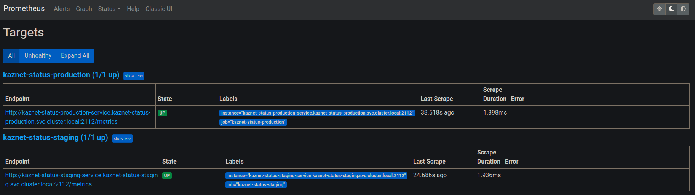

<p align="center"></p>

# Kaznet Status

- Traceroute IPs and if the last hoop ip address belongs to Kazakhstan approve it as IP with internet.

- Send information into telegram if ip connection error occurrence.

- Provide Prometheus metrics for visualization data in grafana with predefined json models.

## TechStack

* GoLang
* GeoLite MaxMind - DB
* Traceroute
* memdb
* Telegram BOT

## Additional data
Telegram BOT in Action in our channel: https://t.me/kaznet_status

### Prometheus(optional)
<p align="center"></p>

### Grafana(optional)
<p align="center"></p>

### K8S(optional) predefined manifests
<p align="center"></p>

# How to develop?
## Old school via go run (Develop)
```bash
./build.sh # sudo required for run binary
```

# How to run?
## Docker-compose (Production)

1. Edit env in docker-compose.yml
```bash
      TZ: Asia/Almaty
      TELEGRAM_BOT_TOKEN: your-bot-token 
      TELEGRAM_BOT_CHAT_ID: your-chat-id
```

2. Build and run
```bash
docker-compose -f docker-compose.yml build
docker-compose -f docker-compose.yml up -d
```

## K8S (Production)

1. Edit env in k8s/production/deployment.yml
```bash
            - name: TELEGRAM_BOT_CHAT_ID
              value: "your-chat-id"
            - name: TELEGRAM_BOT_TOKEN
              value: your-bot-token
            - name: TZ
              value: Asia/Almaty
```

2. Create service account in your k8s cluster
```bash
cd k8s/production

./service-account-for-cd.sh
```

3. Deploy manifests
```bash
kubectl apply -f deployment.yaml
```